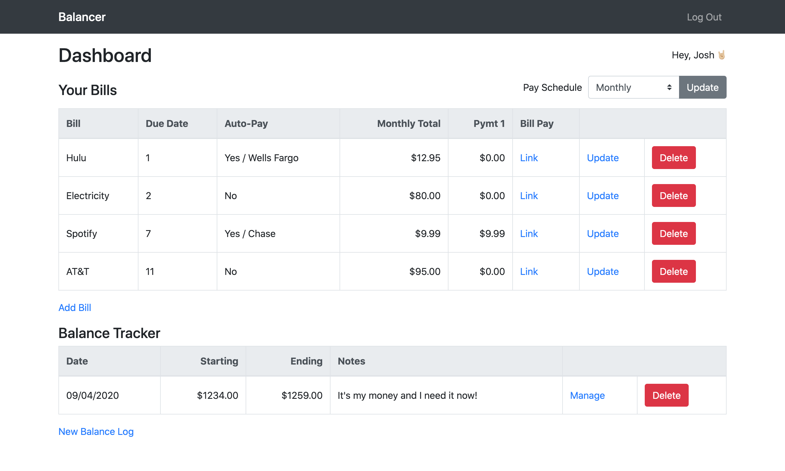
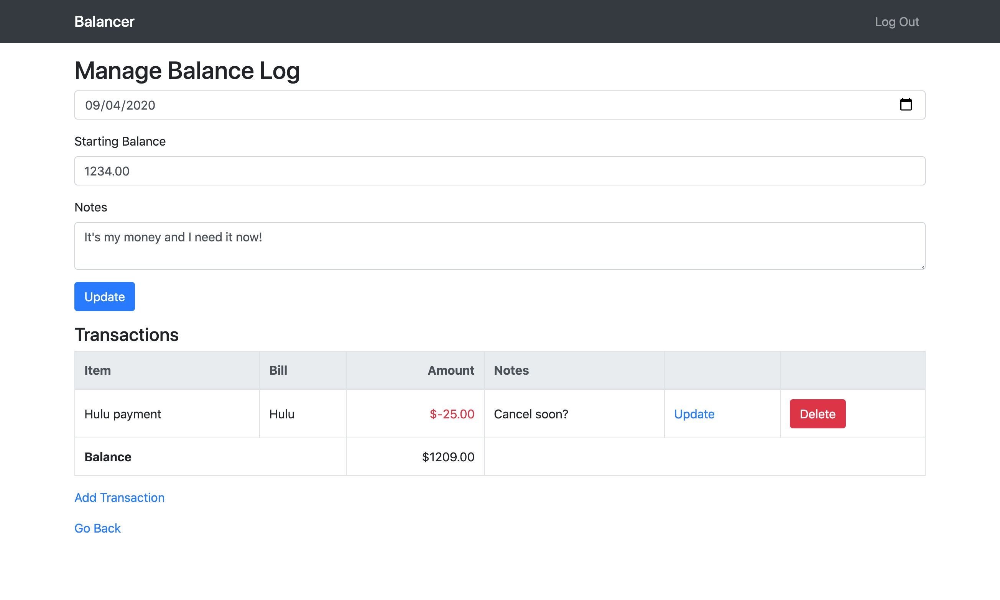
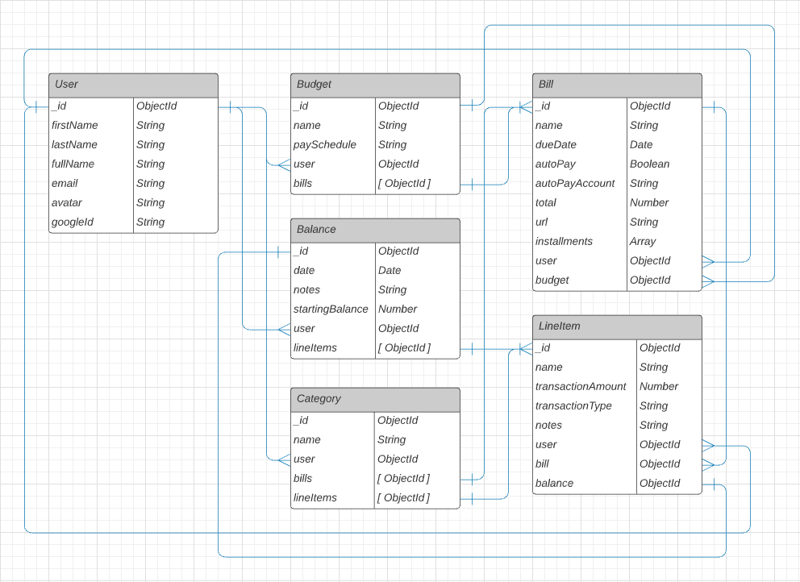

# Balancer

Stay on top of your finances. Track your bills and log your balances.

## Screenshots

## Technologies Used

- MongoDB / Mongoose
- ExpressJS / Express Generator
- NodeJS
- JavaScript
- HTML
- CSS
- Bootstrap
- Google OAuth
- PassportJS
- CRUD Functionality

## Getting Started

- Check out the [Demo](https://j0w0-balancer.herokuapp.com/) on Heroku
- Fork repo to make any feature changes and/or pull requests.

## Next Steps

- Customize/update Bootstrap styles via Sass
- Inline editing and saving
- Implement categories and show data visualizations
- Refine UX and refactor using partial templates
- Stricter validation and use of regular expressions
- Rename routes to better describe data entities

## Planning

<!-- [Trello](https://trello.com/b/N82CQMn5/balancer) -->